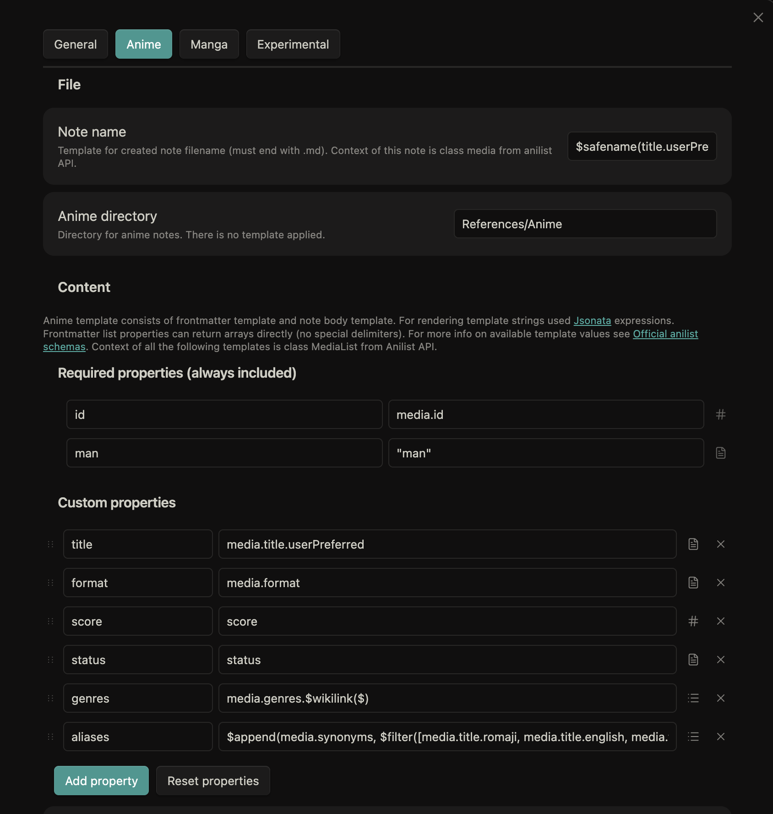
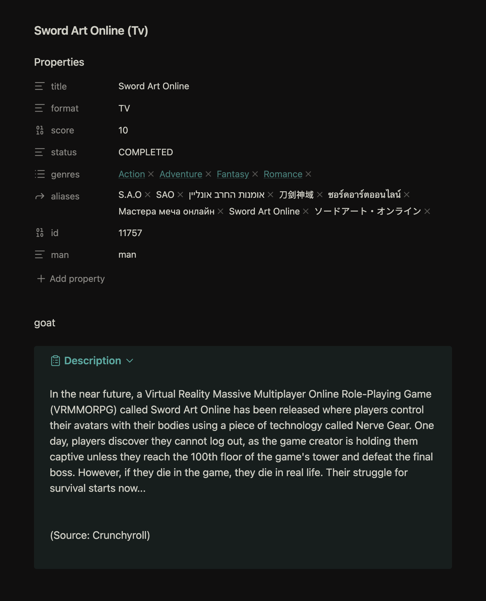

# AniNotes

> **⚠️ Development Status**: This plugin is in early alpha and may have bugs. If you encounter issues or have suggestions, please open an issue or submit a pull request.

AniNotes is an Obsidian plugin that synchronizes your AniList anime and manga lists with your Obsidian vault, creating rich, metadata-powered notes for your media tracking and note-taking needs.

*This plugin is heavily inspired by the MyAnimeNotes plugin, which was unfortunately deleted by its original author.*

## 🚀 Features

- **Automatic Sync**: Download your complete AniList anime and manga lists directly into Obsidian
- **Rich Metadata**: Access comprehensive AniList metadata for use in templates and queries
- **Progress Tracking**: Sync your watching/reading progress and scores
- **Custom Templates**: Use Jsonata templates to customize note creation
- **Relations Support**: Automatically link to prequels, sequels, adaptations, and other related media
- **Property Sync**: Keep your note properties in sync with AniList data
- **Vault Integration**: Reference your media notes in other Obsidian notes using standard wiki links

## 📦 Installation

Easiest way to install plugin is to use BRAT.

Right now plugin is only available as source code. You can install it by downloading source code and placing it in your obsidian plugins folder.

## ⚙️ Configuration

### Initial Setup
1. After installing, open AniNotes settings in Obsidian Settings → Community Plugins → AniNotes
2. Log in with your AniList account
3. Configure your preferred sync settings:
   - Sync frequency (manual, daily, weekly)
   - Note folder location
   - Template customization
   - Metadata fields to include

### Template Customization
AniNotes uses Jsonata json-templates for note creation. You can customize:
- Note structure and layout
- Which metadata fields to include
- How relations are displayed
- Custom properties and formatting

## 📖 Usage

### Basic Usage
1. **Initial Sync**: Use the "Sync All" command to download your entire AniList
2. **Manual Updates**: Use "Sync Changes" to update only modified entries
3. **Individual Sync**: Right-click on specific entries to sync them individually

### Avaliable helpers (Jsonata filters)
- [x] upper
- [x] lower
- [x] capital
- [x] trim
- [x] safename
- [x] wikilink
- [x] link
- [x] date (fuzzy date to YYYY-MM-DD)
- [x] callout
- [ ] join
- [ ] cases
    - [ ] snake
    - [ ] kebab
    - [ ] camel
    - [ ] pascal
    - [ ] uncamel
- [ ] replace
- [ ] blockquote
- [ ] image

### Template Examples

[Static AniList schema reference](https://docs.anilist.co/reference/query) for using in templates.

- [ ] TODO: Add template examples

## 🔧 Development

### Project Structure
- `src/main.ts` - Main plugin entry point
- `src/api/` - AniList GraphQL API integration
- `src/settings/` - Plugin configuration and UI
- `src/template/` - Jsonata template processing
- `src/models/` - TypeScript interfaces and types

## 🤝 Contributing

Contributions are welcome! Please feel free to:
- Report bugs via [GitHub Issues](https://github.com/zzu1u/obsidian-aninotes/issues)
- Submit pull requests for new features or bug fixes
- Suggest improvements to templates or documentation
- Share your custom templates and use cases

## 🙏 Acknowledgments

- Inspired by the original MyAnimeNotes plugin
- Built with [Obsidian API](https://docs.obsidian.md/Plugins/Getting+started/Build+a+plugin)
- Uses [AniList GraphQL API](https://anilist.gitbook.io/anilist-apiv2-docs/overview/graphql/getting-started)
- Template rendering powered by [Jsonata](https://jsonata.org)

---

**Note**: This plugin is not affiliated with or endorsed by AniList or Obsidian.